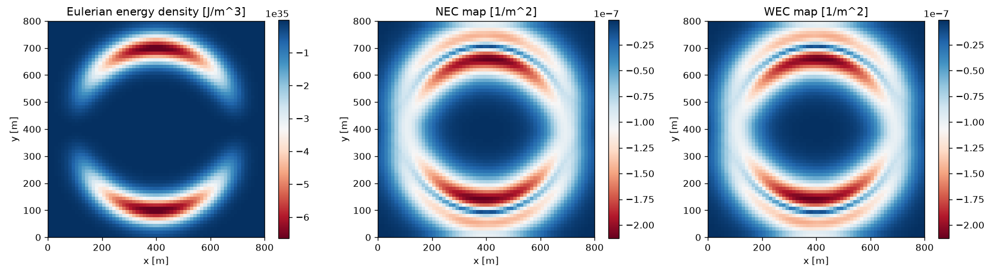

# WarpFactory (Python Port)

[](https://github.com/JohnsterID/WarpFactory/actions/workflows/tests.yml)
[](https://johnsterid.github.io/WarpFactory/)
[](https://opensource.org/licenses/MIT)
[](https://www.python.org/downloads/)
[](https://mybinder.org/v2/gh/JohnsterID/WarpFactory/main?labpath=examples%2Finteractive_explorer.ipynb)
[](https://colab.research.google.com/github/JohnsterID/WarpFactory/blob/main/examples/interactive_explorer.ipynb)

A Python port of [WarpFactory](https://github.com/NerdsWithAttitudes/WarpFactory),
a numerical toolkit for analyzing warp drive spacetimes using
Einstein's theory of General Relativity. Feature parity with the
original MATLAB implementation, with a few deliberate physics-first
fixes ([documented here](https://johnsterid.github.io/WarpFactory/parity/)).



*Eulerian energy density and Null/Weak energy-condition violation maps
for the Alcubierre metric with the WarpFactory paper's Section 4.1
parameters. Regenerate with `python examples/alcubierre_energy_conditions.py`.*

## Highlights

- **Metrics on 4-D grids and 1-D slices:** Alcubierre, Lentz,
  Van Den Broeck, Modified Time (lab and comoving frames), TOV-based
  Warp Shell, Schwarzschild, Minkowski, and custom metrics
- **Einstein field equation solver:** 2nd/4th-order finite differences
  to the stress-energy tensor, validated against analytic solutions
  and the published WarpFactory paper figures (to 2%); plus an exact
  curvature pipeline for analytic metric functions via hyper-dual
  automatic differentiation (machine-precision derivatives, no stencil
  truncation error, no extra dependencies)
- **Energy conditions:** Null/Weak/Dominant/Strong violation maps by
  observer sampling in the local Eulerian frame, plus
  observer-independent all-observer margins via Hawking-Ellis
  classification of the stress-energy eigenstructure, closed-form
  worst-observer witnesses, and the averaged null energy condition
  (ANEC) along axial rays of 1-D slices or arbitrary off-axis null
  geodesics of analytic metrics
- **Analysis:** curvature invariants, kinematic scalars, geodesics,
  horizons, singularities, lensing, tidal forces, Ford-Roman quantum
  inequality bounds
- **Modified gravity:** effective stress-energy in metric-formalism
  f(R) gravity (Starobinsky R + alpha R^2, cosmological constant, or
  any custom Lagrangian) and Jordan-frame Brans-Dicke scalar-tensor
  gravity, sharing the metric-first pipeline with the GR solver
- **Semiclassical and 3+1 diagnostics:** conformal trace anomaly of
  massless quantum fields (validated against published Schwarzschild
  and de Sitter closed forms) and ADM Hamiltonian/momentum constraint
  residuals for initial-data validity of metric slices
- **Optimization:** parameter scans and exotic-matter minimization
  over metric ansatz families
- **Interactive:** Jupyter/ipywidgets explorer with live diagnostics
  ([try it on Binder](https://mybinder.org/v2/gh/JohnsterID/WarpFactory/main?labpath=examples%2Finteractive_explorer.ipynb));
  optional PyTorch GPU backend

## Installation

```bash
# From source (not yet published on PyPI)
git clone https://github.com/JohnsterID/WarpFactory.git
cd WarpFactory
pip install .                        # core: numpy/scipy/matplotlib
pip install ".[jupyter]"             # + interactive notebook explorer
pip install ".[torch,jupyter,gui]"   # everything
```

## Quickstart

```python
import numpy as np

from warpfactory.metrics import AlcubierreMetric
from warpfactory.solver import EnergyTensor
from warpfactory.analyzer import EnergyConditions

x = np.linspace(-8, 8, 400)
y, z = np.zeros_like(x), np.zeros_like(x)

metric = AlcubierreMetric().calculate(x, y, z, t=0, v_s=2.0, R=1.0, sigma=4.0)
T_munu = EnergyTensor().calculate_from_metric(metric, x)

print(T_munu["T_tt"].min())                      # negative energy at the wall
print(EnergyConditions().check_weak(T_munu))     # False: WEC is violated
```

Full documentation at **[johnsterid.github.io/WarpFactory](https://johnsterid.github.io/WarpFactory/)**:
[Installation](https://johnsterid.github.io/WarpFactory/installation/) |
[Quickstart](https://johnsterid.github.io/WarpFactory/quickstart/) |
[Applications](https://johnsterid.github.io/WarpFactory/applications/) |
[Interactive Explorer](https://johnsterid.github.io/WarpFactory/interactive/) |
[GPU Acceleration](https://johnsterid.github.io/WarpFactory/gpu/) |
[MATLAB Parity](https://johnsterid.github.io/WarpFactory/parity/)

Runnable scripts live in [`examples/`](examples/).

## Testing

```bash
pytest warpfactory/tests -q --no-cov
```

The core suite needs only numpy/scipy/matplotlib; tests for optional
backends (torch, Qt, ipywidgets) skip automatically when the extra is
not installed. Quantitative validation against the WarpFactory paper
(arXiv 2404.03095) is committed as
`warpfactory/tests/test_paper_validation.py`.

## Citing

If you use WarpFactory in research, please cite the method paper and
this port -- see [`CITATION.cff`](CITATION.cff) or the "Cite this
repository" button on GitHub.

```bibtex
@article{Helmerich2024WarpFactory,
  title   = {Analyzing warp drive spacetimes with {Warp Factory}},
  author  = {Helmerich, Christopher and Fuchs, Jared and Bobrick,
             Alexey and Sellers, Luke and Melcher, Brandon and
             Martire, Gianni},
  journal = {Classical and Quantum Gravity},
  volume  = {41},
  number  = {9},
  pages   = {095009},
  year    = {2024},
  doi     = {10.1088/1361-6382/ad2e42}
}
```

## Parity with the MATLAB original

This port is based on upstream commit `03b10cb` of
[NerdsWithAttitudes/WarpFactory](https://github.com/NerdsWithAttitudes/WarpFactory);
this repository's git history starts at the Python port. It is a
physics-first port, not a bug-for-bug one: geometric units (G = c = 1),
zero-based grid indexing, fixed Modified Time metric bugs, and a
consistent local-frame convention in the energy conditions. The full
list with rationale is on the
[MATLAB Parity](https://johnsterid.github.io/WarpFactory/parity/) page.

## License

MIT -- see [LICENSE](LICENSE). The license retains the copyright of
the original MATLAB WarpFactory authors (Christopher Helmerich &
Jared Fuchs) alongside the Python port copyright.

## Acknowledgments

Based on the original MATLAB WarpFactory by Christopher Helmerich and
Jared Fuchs, with contributions from Alexey Bobrick, Luke Sellers,
Brandon Melcher, Justin Feng, and Gianni Martire.

- [Original repository](https://github.com/NerdsWithAttitudes/WarpFactory)
- [CQG paper](https://iopscience.iop.org/article/10.1088/1361-6382/ad2e42)
  ([arXiv preprint](https://arxiv.org/abs/2404.03095))
